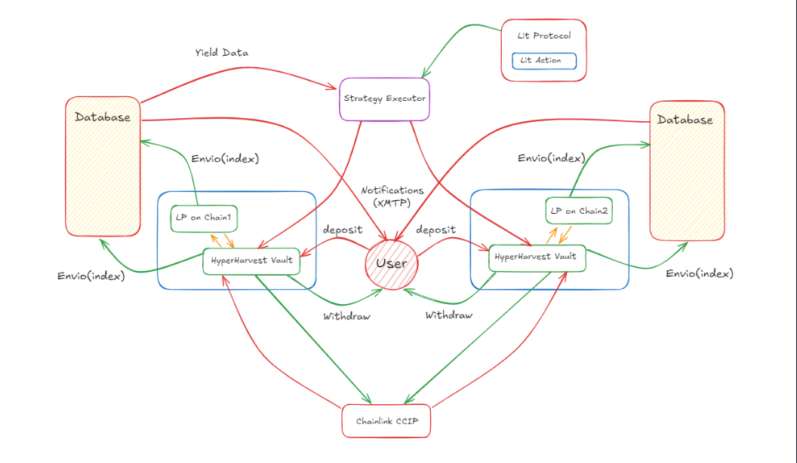

# 👨‍💼 System Overview

\
\
Our Cross-Chain Yield Aggregator consists of several interconnected components:

<figure><figcaption>
HyperHarvest Architecture
</figcaption></figure>

1. **HyperHarvest Smart Contract**: The core of our system, deployed on Arbitrum Sepolia and Optimism Sepolia.
2. **Lit Protocol**: Handles the encryption , decryption ,  execution of our private strategies time to time to ensure optimal yields.
3. **Chainlink CCIP**: Facilitates cross-chain communication and fund transfers.
4. **Envio**: Hyperindexes blockchain data for real-time yield calculations and event tracking for real time notifications.
5. **XMTP Bot** : Provides real-time notifications to users and method to deposit/withdraw using frames in the bot.
6. **Web3Auth**: Enables social login and account abstraction.
7. **Frontend**: A user-friendly interface for interacting with the protocol.
